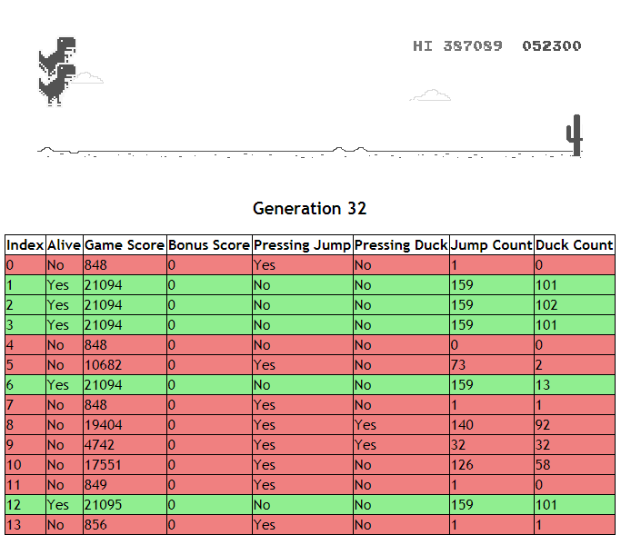
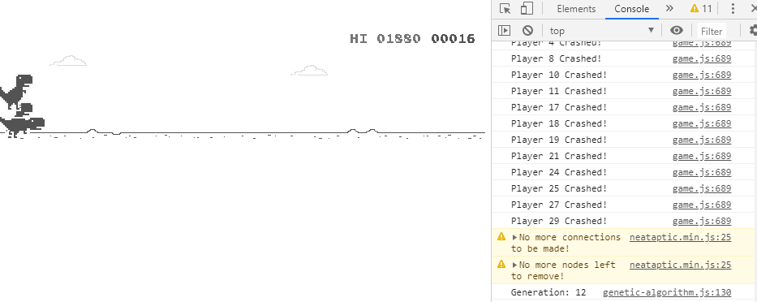
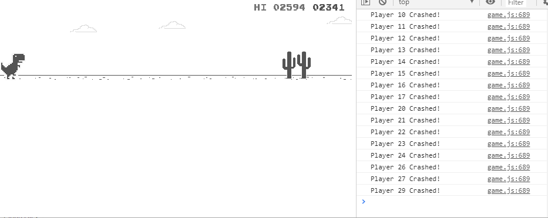
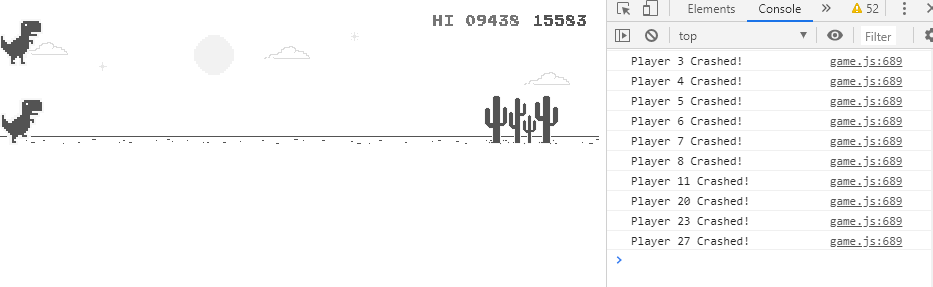

# Neuroevolution for Chrome T-Rex Runner Game
This is an implementation of a neuroevolution (a.k.a. genetic) algorithm to the Google Chrome T-Rex Runner game.

## Sources/Libraries used
 - [wayou/t-rex-runner](https://github.com/wayou/t-rex-runner) - Source code of the game
 - [wagenaartje/neataptic](https://github.com/wagenaartje/neataptic) - Neuroevolution library which implements the NEAT algorithm

## Demo(s)
Current version:

Old versions:

## Work in Progress
This little project still isn't complete and definitely needs improvements on the UI and the AI - specifically, how the game states are made (the states need to be easy for the AI to "understand") and the NEAT parameters.
